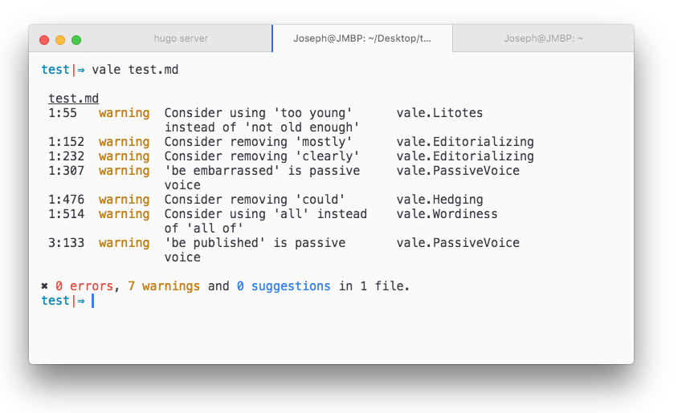

## About

Vale is an open source linter for prose—no matter if it's plain text, markup or source-code comments. It's built around a plugin system that allows it to lint against arbitrary rules. In practice, this means that it can help you adhere to entire editorial style guides or simply break writer-specific bad habits.



## Installation

Vale works on Windows, macOS, and Linux. Installation is straightforward and there are a few options to choose from, as discussed below.

**Windows Installer**

!!! warning "NOTE"

    You may be warned about the package coming from an "unidentified developer." If you're not comfortable with this, you can install manually (see below).

The easiest way to install on Windows is to use the Windows Installer package, `vale.msi` (which you'll find on the [releases page](https://github.com/ValeLint/vale/releases)).

**Homebrew (macOS)**

The easiest way to install on macOS is through [Homebrew](https://brew.sh/):

```bash
$ brew tap ValeLint/vale
$ brew install vale
```

**Manually (Windows, macOS & Linux)**

Download a binary from the [releases page](https://github.com/ValeLint/vale/releases) for your OS.

You can put it anywhere you want. If you're not sure how to get started, check out one of our guides below.

- [Getting Started with Vale (Windows)](#) (Coming soon.)
- [Getting Started with Vale (macOS)](https://jdkato.github.io/2017/02/26/getting-started-with-vale-mac.html)
- [Getting Started with Vale (Ubuntu)](#) (Coming soon.)

**Using Go (Windows, macOS & Linux)**

If you have [Go](https://golang.org/) installed and configured, you can install with `go get`:

```bash
$ go get github.com/ValeLint/vale
```
