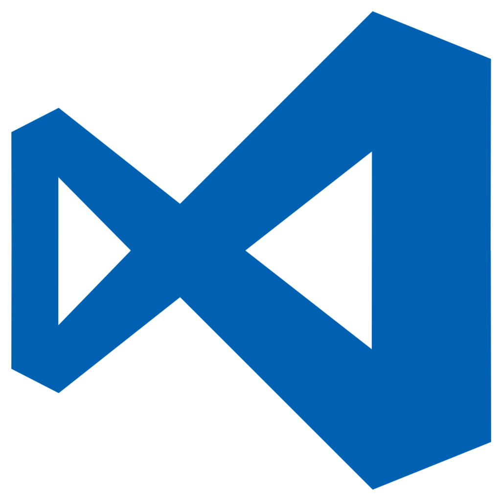

## About

```callout{'title': 'Heads up!', 'classes': ['success']}
**Tired of the command line?** Vale now has a [cross-platform desktop application](https://errata.ai/vale-server/) that introduces a number of new features.
```


**Vale** is a cross-platform (macOS, Windows, and Linux), command-line linter for prose built with speed and extensibility in mind.

Unlike most writing-related software, Vale's primary purpose isn't to provide its own advice; it's designed to
enforce an existing style guide through its YAML-based [extension system](/vale/styles).

No matter if you're working with a small in-house standard or a large editorial style guide, Vale
will help you maintain consistent and error-free writing.

## Installation

```callout{'title': 'Heads up!', 'classes': ['tip']}
If you're using Vale with a markup format other than Markdown or HTML, you'll also need to install a [parser](https://errata-ai.github.io/vale/formats/#formats).
```

Vale offers multiple options for installation, each of which best suits a particular use case.

### Remote, collaborative use

One of Vale's strengths is its ability to help a company, project, or organization maintain consistency (capitalization styles, word choice, brand terminology, spelling etc.) across multiple writers.

The benefits of the following installation methods are that every writer has access to the same Vale configuration without having to install and configure the tools themselves.

#### Using Vale with GitHub

If you want to lint the contents of a GitHub repository, the recommended approach is to use Vale's [official GitHub Action](https://github.com/errata-ai/vale-action).

#### Using Vale with a continuous integration (CI) service

If you want to use Vale with a CI service such as Travis CI, CircleCI, or Jenkins, the recommended approach is to use Vale's
[GoDownloader](https://github.com/goreleaser/godownloader) script (Vale will be installed to `/bin/vale`):

```console
$ curl -sfL https://install.goreleaser.com/github.com/ValeLint/vale.sh | sh -s vX.Y.Z
$ export PATH="./bin:$PATH"
$ vale -v
```
where `vX.Y.Z` is your version of choice from the [releases page](https://github.com/errata-ai/vale/releases). This will ensure that your CI builds are consistent and allow you to update versions on an opt-in basis.

### Local use by a single writer

Vale can also be used locally by a single writer through their command line or a third-party integration.

#### Using Vale with a text editor (or another third-party application)

Vale has a commercial desktop application, [Vale Server](https://errata.ai/vale-server/), that integrates with [many third-party applications](https://errata-ai.github.io/vale-server/docs/usage#step-5-using-a-client-application) (including Atom, Sublime Text, VS Code, and Google Docs) and allows writers to easily create and switch between multiple local Vale configurations.

<table style="width:100%">
  <tr>
    <th>Atom</th>
    <th>Sublime Text</th>
    <th>Visual Studio Code</th>
    <th>Google Docs</th>
    <th>Google Chrome</th>
  </tr>
  <tr>
    <td><a href="https://github.com/errata-ai/vale-atom"></a></td>
    <td><a href="https://github.com/errata-ai/SubVale"></a></td>
    <td><a href="https://github.com/errata-ai/vale-vscode"></a></td>
    <td><a href="https://errata-ai.github.io/vale-server/docs/gdocs"></a></td>
    <td><a href="https://errata-ai.github.io/vale-server/docs/chrome"></a></td>
  </tr>
</table>

It also [offers seamless integration](https://errata-ai.github.io/vale-server/docs/style#third-party-styles) with [LanguageTool](https://www.languagetool.org/), providing access to over 2,000 English grammar rules.

#### Using Vale from the command line

Vale can be installed for local usage. To install the CLI, use one of the following options:

- Download an executable from the [releases page](https://github.com/errata-ai/vale/releases).
- Pull the [latest Docker container](https://cloud.docker.com/repository/docker/jdkato/vale).
- Install with one of the following paackage managers:

    [](https://repology.org/project/vale/versions)

